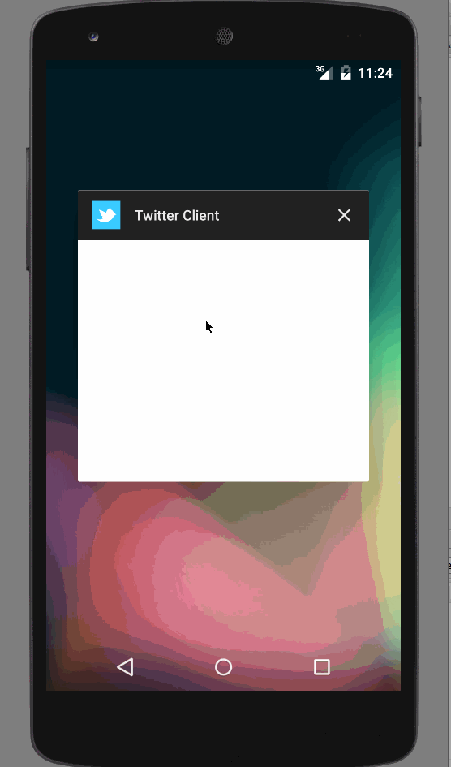

#Twitter Client

This Android Twitter client will display twitter timeline and allow user to post tweet

Time spent: 14 hours spent in total

Completed user stories:

 * [x] Required: User can sign in to Twitter using OAuth login
 * [x] Required: User can view the tweets from their home timeline
 * [x] Required: User should be displayed the username, name, and body for each tweet
 * [x] Required: User should be displayed the relative timestamp for each tweet "8m", "7h"
 * [x] Required: User can view more tweets as they scroll with infinite pagination
      * Optional: Links in tweets are clickable and will launch the web browser
 * [x] Required: User can compose a new tweet using 
     * “Compose” icon in the Action Bar on the top right, 
     * User can then enter a new tweet and post this to twitter, 
     * User is taken back to home timeline with <b>new tweet visible<b>in timeline
     * Optional: Links in tweets are clickable and will launch the web browser
     * Optional: User can see a counter with total number of characters left for tweet
 * [x] Advanced: User can refresh tweets timeline by pulling down to refresh (i.e pull-to-refresh)
 * [x] Advanced: Display each photo with the same style and proportions as the real Instagram

Week 4
 * [x] User can switch between Timeline and Mention views using tabs.
 * [x] User can view their home timeline tweets.
 * [x] User can view the recent mentions of their username.
 * [x] User can navigate to view their own profile
 * [x] User can see picture, tagline, # of followers, # of following, and tweets on their profile.
 * [x] User can click on the profile image in any tweet to see another user's profile.
 * [x] User can see picture, tagline, # of followers, # of following, and tweets of clicked user.
 * [x] Profile view should include that user's timeline
 * [x] Optional: User can infinitely paginate any of these timelines (home, mentions, user) by scrolling to the bottom

Notes:

Walkthrough of all user stories:

